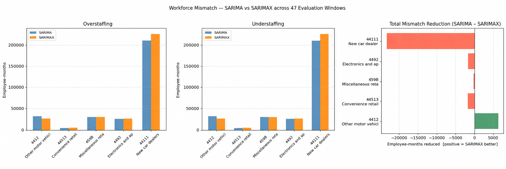

# Weather-Based Demand Forecasting & Workforce Optimization

<kbd>Python</kbd>
<kbd>Pandas</kbd>
<kbd>NumPy</kbd>
<kbd>Statsmodels</kbd>
<kbd>SciPy</kbd>
<kbd>Matplotlib</kbd>

An end-to-end analytics case study exploring whether weather conditions can improve retail demand forecasts in Ontario, and how forecast quality can influence downstream workforce planning.

[1. Project Context](#project-context)  
[2. Data Sources](#data-sources)  
[3. Methodology](#methodology)  
[4. Data Preparation & EDA](#data-preparation--eda)  
[5. Demand Forecasting](#demand-forecasting)  
[6. Workforce Impact ](#workforce-impact)  
[7. Project Limitations](#project-limitations)  
[8. Key Insights & Recommendations ](#key-insights--recommendations)  

---

## Project Context

Retail demand is influenced by more than historical sales patterns. External factors such as temperature, precipitation, and snowfall can affect consumer behavior, potentially making weather useful for anticipating changes in demand.

This project explores whether incorporating weather data into retail demand forecasting can provide meaningful improvements over traditional time-series models — and, more importantly, whether those improvements can translate into better workforce planning.

### Key Questions & Hypotheses

**1. Can weather indicators improve retail demand forecasting across different retail sectors?**

- **H₀:** Incorporating weather variables does not significantly improve forecast accuracy compared with traditional forecasting methods.
- **H₁:** Incorporating weather variables significantly improves forecast accuracy compared with traditional forecasting methods.

**2. If forecasting improves, can those improvements reduce overstaffing and understaffing?**

- **H₀:** Workforce allocation based on weather-sensitive forecasts does not significantly reduce workforce mismatch compared with traditional forecasts.
- **H₁:** Workforce allocation based on weather-sensitive forecasts significantly reduces workforce mismatch compared with traditional forecasts.

## Data Sources

The project combines retail demand, weather, employment, and earnings data from 2017–2025 using publicly available sources.

| Dataset                 | Source                | Frequency | Purpose                                                   |
| ----------------------- | --------------------- | --------- | --------------------------------------------------------- |
| Ontario Weather         | [NASA POWER API](https://power.larc.nasa.gov/)    | Daily     | Weather indicators used as external forecasting variables |
| Ontario Retail Sales    | [Statistics Canada](https://www150.statcan.gc.ca/t1/tbl1/en/tv.action?pid=2010005601) | Monthly   | Historical demand across 28 retail subsectors             |
| Employment              | [Statistics Canada](https://www150.statcan.gc.ca/t1/tbl1/en/tv.action?pid=1410035501) | Monthly   | Estimate workforce requirements from retail demand        |
| Average Weekly Earnings | [Statistics Canada](https://www150.statcan.gc.ca/t1/tbl1/en/tv.action?pid=1410020301) | Monthly   | Estimate labor costs and staffing mismatch penalties      |

## Methodology

 

 

The project follows an end-to-end analytical pipeline, beginning with the collection and preparation of public retail and weather data. Weather features are explored and selected before comparing traditional and weather-sensitive forecasting models. Forecast outputs are then translated into workforce requirements to evaluate whether improvements in predictive accuracy lead to better operational decisions.

## Data Preparation & EDA

Daily weather observations from **35 locations across Ontario** were combined into a province-wide dataset and aligned with monthly retail sales data.

Key preparation and analytical steps included:

- Cleaning and temporally aligning the retail and weather datasets.
- Engineering **Heating Degree Days (HDD)**, **Cooling Degree Days (CDD)**, and snow-day indicators.
- Choosing which predictors will be passed to the model through correlation and **VIF analysis**.
- Applying **STL decomposition** to separate trend and seasonality from retail demand, allowing weather relationships to be examined against the residual demand component.
- Using **cross-correlation at lags 0–3 months** between weather variables and **STL residual demand** to identify the most weather-sensitive subsectors and narrow the original 28 retail sectors to five forecasting candidates.

> This stage ensured that apparent weather relationships were not simply caused by shared seasonal patterns. It produced a focused set of weather regressors and retail sectors for a more controlled test of whether weather could add predictive value beyond historical demand.

## Demand Forecasting

Four forecasting approaches were compared across the five selected retail sectors:

`Naïve` · `Seasonal Naïve` · `SARIMA` · `SARIMAX`

The **Naïve and Seasonal Naïve models** were included as simple benchmarks. **SARIMA** was selected as the main statistical baseline because the retail series exhibited clear seasonality, while **SARIMAX** extended the same structure by adding weather variables to test their incremental predictive value.

Performance was measured using **MAPE, MAE, and RMSE**, followed with the Diebold–Mariano test to assess whether SARIMAX produced a statistically meaningful improvement over SARIMA.

### Forecast Results

Weather-sensitive forecasting did **not** improve performance consistently across sectors.

The main improvement appeared in subsector **Other motor vehicle dealers [4412]**, where SARIMAX reduced MAPE from **19.53% to 17.78%** compared with SARIMA. The Diebold–Mariano test also indicated that this improvement was statistically significant.

For the remaining sectors, SARIMAX performed similarly to or worse than SARIMA, showing that the predictive value of weather was **sector-specific rather than universal**.

| Sector                             | SARIMA MAPE | SARIMAX MAPE | ΔMAPE       | Practical sig. |
| ---------------------------------- | ----------- | ------------ | ----------- | -------------- |
| Other motor vehicle dealers [4412] | 19.53%      | 17.78%       | **+1.75pp** | **✓ Yes**      |
| Convenience retailers [44513]      | 3.62%       | 4.33%        | −0.70pp     | ✗ No           |
| Miscellaneous retailers [459B]     | 5.46%       | 5.48%        | −0.03pp     | ✗ No           |
| Electronics and appliances [4492]  | 4.69%       | 4.81%        | −0.12pp     | ✗ No           |
| New car dealers [44111]            | 6.82%       | 7.22%        | −0.39pp     | ✗ No           |

_Comparison of SARIMA and SARIMAX forecast accuracy across the selected retail sectors._

## Workforce Impact

The second phase tested whether improvements in forecast accuracy translated into better staffing decisions.

Monthly forecasts were converted into workforce requirements using Ontario employment and wage data, then compared against staffing needs implied by actual demand. The analysis measured **overstaffing, understaffing, total workforce mismatch, and modeled penalty cost** across the same 47 forecast periods.

_Workforce mismatch comparison under SARIMA- and SARIMAX-based staffing decisions._

For **Other motor vehicle dealers [4412]**, SARIMAX reduced total workforce mismatch from **62,985 to 55,098 employee-months**, a **12.52% reduction**. Modeled penalty cost also decreased from **$362.93M to $320.75M**, an **11.62% reduction**.

## Project Limitations

The main limitation of this project was **data granularity**. While weather data was available daily, publicly available Ontario retail demand data was only available at a monthly level. As a result, daily weather observations had to be aggregated to monthly frequency before they could be aligned with retail sales.

This aggregation likely weakened the observable effect of short-term weather events. Conditions such as heavy snowfall, rainfall, or unusual temperatures may influence demand over only a few days, but at monthly frequency these effects become blended with broader seasonal patterns.

For this reason, the project should be viewed primarily as a demonstration of the **analytical framework and end-to-end pipeline** for weather-informed demand forecasting and workforce planning. The methodology is transferable, but stronger conclusions about the predictive value of weather would require **daily or transaction-level demand data**.

## Key Insights & Recommendations

The results suggest that weather-informed forecasting should be applied **selectively rather than universally**. Under the available monthly data, SARIMAX improved forecast accuracy and downstream workforce outcomes only for one sector, while the remaining sectors showed little or no benefit from adding weather variables.

### Key Takeaways

- Weather variables should be added only where demand shows measurable weather sensitivity.
- Improvements in forecast accuracy can translate into better staffing decisions, but only when the underlying forecast meaningfully improves.
- Monthly retail data likely limits the ability to capture short-term, event-driven weather effects.
- Future implementations should prioritize **daily or transaction-level demand data** to better capture short-term weather effects.

---

### How to Run

Run the notebooks in numerical order:

1. Download and prepare weather data.
2. Explore and validate the weather dataset.
3. Build and evaluate demand forecasting models.
4. Translate forecast outputs into workforce impact analysis.

A detailed report of the project, including the complete methodology, statistical analysis, and results, can be accessed [HERE!](report/report.pdf)

### Contributors :

[Mustafa Abdulmegid](https://github.com/awafa116) |
[Renan Da Silva Sousa](https://github.com/RenanSdeSilva) |
[Alfredo Villalobos](https://github.com/AlfredoVilla97) |
[David Enejo](.)

 
 
 

 -- Mustafa Abdulmegid · MARCH 2026 -- 

